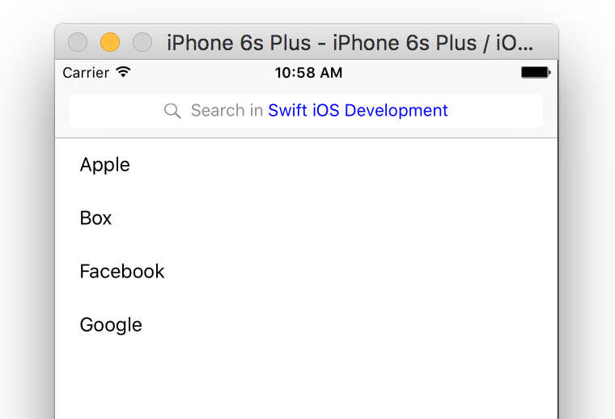

# How to Highlight Text in Search Bar
A demo shows how to highlight certain text in the search bar like Facebook app does.

[]()

### Demo ###
<br />

In this demo, I am going to show you how to highlight the "Swift iOS Development" string of search bar placeholder.

### The Idea ###

The idea is simple, we just have to change the color for a substring!

Let's say the placeholder text is `Search in Swift iOS Development`, and to change the color of `Swift iOS Development` to blue, we can use `NSMutableAttributedString.addAttribute(name, value, range)` function.

```swift
let placeholder = "Search in Swift iOS Development"
let keyword = "Swift iOS Development"
let range = (placeholder as NSString).rangeOfString(keyword)

let attributedString = NSMutableAttributedString(string: placeholder)
attributedString.addAttribute(NSForegroundColorAttributeName, value: UIColor.blueColor(), range: range)

let searchTextField = searchBar.valueForKey("searchField") as? UITextField
searchTextField?.attributedPlaceholder = attributedString
```

And how to change the placeholder when we tap on it? Simple, conform the `UISearchBarDelegate` protocol and implement the following two functions:

```swift
func searchBarTextDidBeginEditing(searchBar: UISearchBar) {
  let searchBar = searchController.searchBar
  searchBar.placeholder = "Search"
}
```

```swift
func searchBarTextDidEndEditing(searchBar: UISearchBar) {
  let searchBar = searchController.searchBar
  // highlight the searchBar placeholder here...
}
```

That's it, for detailed implementation, please see the source code of the demo.

<br />

Author: Yong Su @ Box Inc.
